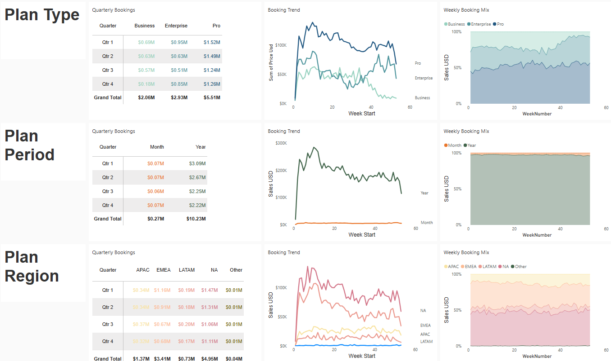

# Zoom Booking Analysis Dashboard

Analysing Zoom Subscription Trends in 2021. The interactive Power BI report can be found [here](https://app.powerbi.com/view?r=eyJrIjoiNzE0NmQ3NzQtOWI4MC00NDgxLTk0YjEtYmQ1M2QxMDA5NmRhIiwidCI6Ijc1ZGNjYmU1LWRjMTUtNDEwNS1iM2JiLTljZDBlN2E3YTY5MiJ9&pageName=8ac1c0737d69a0932cea). 

## Dashboard Insights Summary

---

# North Star Metrics and Dimensions

- **Sales:** Total subscription sales from pro, business, and business plus plans  
- **Plan type:** Business, enterprise, or pro  
- **Plan period:** Yearly or monthly plan  
- **Plan region:** Asia Pacific (APAC), North America (NA), Latin America (LATAM), Europe, Middle East, Africa (EMEA)  

## Summary of Insights

### Plan Type
- At the start of the pandemic, Enterprise plans had a significant spike and a record-high of $226K in bookings in one week. This spike then significantly decreased and slowed in both the summer of 2020 and the summer of 2021.  
- Business plans completely dropped off at the end of 2021 – investigate whether there is an **issue with the product** or **a new competitor** for this market.  

### Plan Period
- **Yearly plans make up over 90% of bookings**, but have exhibited a significant drop-off towards the **end of 2021** that was not seen in monthly plans.  

### Plan Region
- During the **Peak COVID** months in early 2020, North America made up almost two-thirds of weekly bookings, and most of the spike in the enterprise was contained to this region.  

## Recommendations & Next Steps
- Investigate why Enterprise plans exhibit a steep dip in summer months and expand this analysis to include more years to examine whether this trend is COVID-related or consistent across time. Can we implement a product feature to combat this dip?  
- Yearly plans have an outsized impact on bookings, so consider adding trials or promotions to improve the dip in yearly plans.
- Long-term commitments (yearly) outperform short-term (monthly), suggesting the importance of customer retention.
- North America is the largest market, but APAC and LATAM present expansion opportunities. EMEA shows a lot of volatility, which might indicate a new approach/strategy or an upcoming new competitor in the market.
